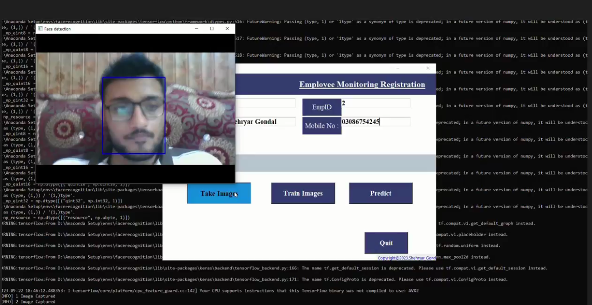
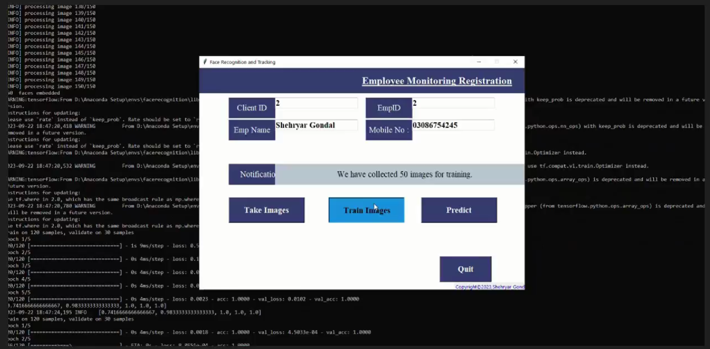
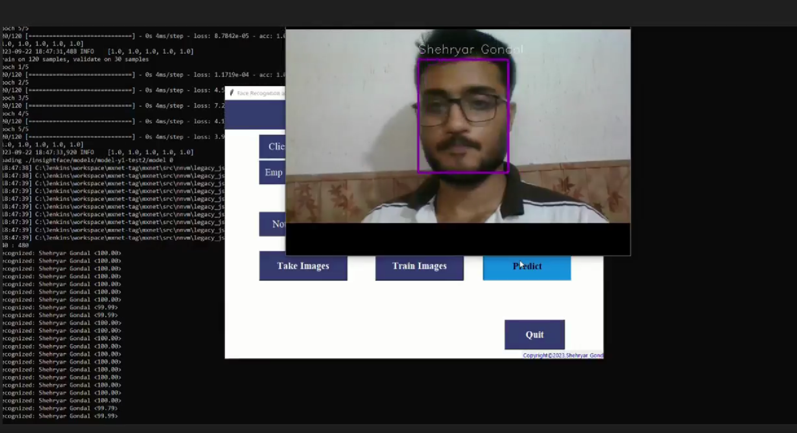

# Vision based Attendence System

This repository contains the code and resources for building a Vision-Based Attendance System. The system utilizes computer vision techniques, particularly the MTCNN (Multi-task Cascaded Convolutional Networks) face detection algorithm, to automate the attendance tracking process by recognizing individuals from images or video streams. This README provides an overview of the use case, the steps involved in creating the system, and the advantages and disadvantages of using MTCNN for this purpose.

  

### Setting up Project Environment :

# Create a new environment
- Step 1 : open your anaconda prompt (for windows user search inside start menu )(for Ubuntu and Mac user you can open your terminal)

- Step 2 : Create a new environment
                command : conda create -n facerecognition python==3.6.9
- Step 3 : activate your environment
                conda activate facerecognition
- Step 4 : Install requirements.txt in the newly created environment
            a). Navigate to your folder location on anaconda prompt/teminal
                    for me ( /PycharmProjects/FaceRecogAcademy )
                    for your folderName
            b). Check if we have requirements.txt or not in the current directory

                    command : for windows (dir)
                              for Mac/Ubuntu(ls)
                    datasets,  How to run.txt,  requirements.txt,  src

                    you should see the above mentioned name of files.

                    if yes:
                        Your are good to go
                    elif No:
                        Please check the steps again you must have missed something

- Step 5 : Installation and setup is done:
         a).  cd src
         b). python clientApp.py

 

### Use Case

The Vision-Based Attendance System is designed for various scenarios where automated attendance tracking is beneficial. Some potential use cases include:

- __Educational Institutions:__ Automatically record student attendance during lectures or classes.
- __Corporate Environments:__ Simplify attendance management for employees during meetings, training sessions, or daily check-ins.
- __Events and Conferences:__ Streamline attendance tracking at conferences, seminars, and workshops.
- __Security Systems:__ Enhance access control by recognizing authorized personnel at entry points.

### System Workflow

The development of the Vision-Based Attendance System involves the following steps:

- __Data Collection:__ Gather a dataset of images containing individuals whose attendance you want to track.

- __Face Detection (MTCNN):__ Utilize the MTCNN algorithm to perform face detection on the collected images or video frames. This step identifies faces within the images.

- __Bounding Box Regression:__ Refine the face bounding boxes to tightly enclose detected faces, improving the accuracy of face cropping.

- __Face Embedding:__ Extract facial features (embeddings) from the detected faces. This step generates numerical representations of each individual's face.

- __Attendance Prediction:__ Implement a classification model, often using a softmax function, based on the number of individuals whose attendance you want to track. Train the model using the face embeddings to recognize individuals and predict their attendance.

- __Attendance Recording:__ Use the predictions from the model to record attendance for each individual in a database or attendance sheet.

### Advantages and Disadvantages of MTCNN

__Advantages__

- __Accurate Face Detection:__ MTCNN is known for its high accuracy in detecting faces even in challenging conditions, such as varying lighting and face orientations.

- __Efficient Multi-Stage Process:__ MTCNN consists of multiple stages that work sequentially, with each stage reducing the number of false positives. This results in highly precise face detection.

- __Real-Time Processing:__ MTCNN is optimized for real-time or near-real-time processing, making it suitable for applications that require timely attendance tracking.

__Disadvantages__

- __Resource Intensive:__ While MTCNN is efficient, it can still be resource-intensive, especially if processing high-resolution images or video streams in real time. Hardware acceleration may be necessary in some cases.

- __Limited to Face Detection:__ MTCNN primarily focuses on face detection and bounding box regression. Additional steps, such as face recognition and attendance prediction, must be implemented separately.

- __Training Data Required:__ Training a face recognition model (softmax classifier) requires a labeled dataset of individuals, which may not always be readily available.

### Why MTCNN over Other Algorithms

MTCNN is chosen for this attendance system due to its exceptional accuracy in face detection, especially in real-world scenarios. Its multi-stage architecture helps reduce false positives and provides robust face bounding boxes. While other algorithms like OpenFace offer comprehensive facial recognition capabilities, MTCNN serves as a reliable first step in the attendance tracking process, ensuring that the correct faces are identified and cropped for further processing. This approach allows for flexibility in selecting and training the subsequent components of the system for attendance prediction.

## Result

  
  
  

### AUTHOR

<strong>Shehryar Gondal</strong>

You can get in touch with me on my LinkedIn Profile: 
 

You can also follow my GitHub Profile to stay updated about my latest projects: 

If you liked the repo then kindly support it by giving it a star ⭐.
